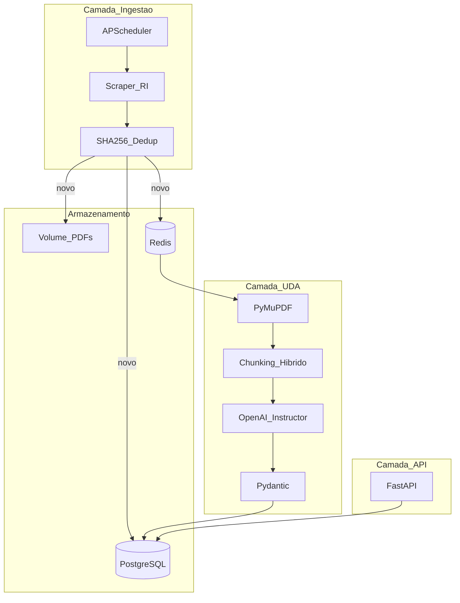

# Arquitetura — Pipeline UDA Habitacional

## Visão geral

O pipeline transforma PDFs não estruturados de Centrais de Resultados (RI) em métricas operacionais consultáveis via API REST. Usa LLMs para extração semântica resiliente a variações de layout.



## Camada 1 — Ingestão (orientada a eventos)

- **Gatilho:** APScheduler com cron diário (06:00 BRT) — polling respeitoso das páginas RI
- **Scraper:** httpx + BeautifulSoup descobre links PDF de "Prévia Operacional"
- **Idempotência:** SHA-256 do binário PDF verificado no catálogo **antes** de chamar o LLM
- **Fila:** novos documentos enfileirados no Celery via Redis

Fontes configuradas em `config/sources.yaml` (MRV, Direcional, Tenda, Cury, Plano & Plano).

## Camada 2 — Processamento UDA

1. **Parser (PyMuPDF):** extrai texto por página; detecta slides rasterizados (< 50 chars)
2. **Chunking híbrido:** full-scan para docs ≤ 15 páginas; filtro semântico por keywords para docs longos
3. **Extractor (Instructor + GPT-4o-mini):** extração estruturada por chunk com contrato Pydantic
4. **Vision fallback (GPT-4o):** apenas para páginas sem texto extraível (slides MRV)

## Camada 3 — Catálogo e linhagem

Tabelas PostgreSQL:

- `documents`: metadados, hash, URL original, status do pipeline
- `metric_values`: métricas extraídas com `source_url`, `pagina_origem`, `chunk_id`, evidência LLM

Cada métrica retornada pela API inclui `fonte_pdf_url` e `documento_id` para rastreabilidade.

## Camada 4 — API REST

FastAPI com endpoints de conjuntura filtráveis por empresa/ano/trimestre e consulta de linhagem por documento.

## Fluxo de status do documento

```
pending → processing → completed
                    ↘ failed
```

## Decisões arquiteturais

Ver [Chunking Híbrido](chunking-hibrido.md).
