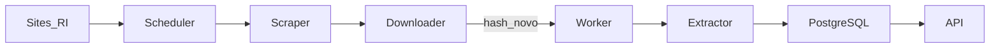
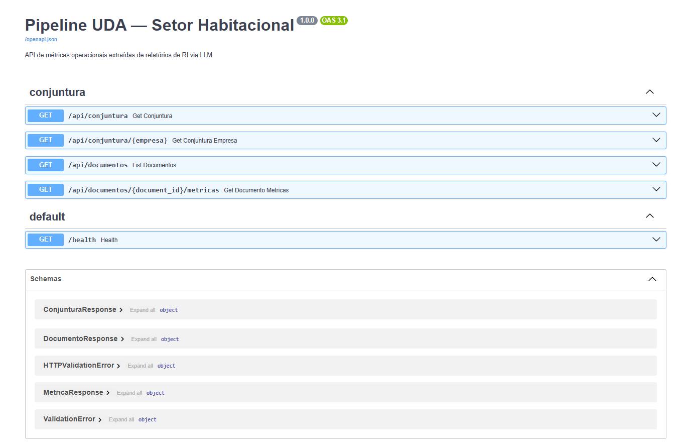
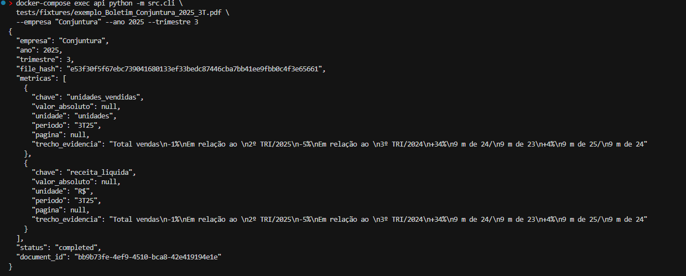

# Relatório de Entrega — Projeto Individual 4: Pipeline UDA (Setor Habitacional)

> **Aluno:** Jefferson Sena  
> **Disciplina:** GCES — Projeto Extra 
> **Data de entrega:** 08/06/2026  

---

## 1. Resumo do Projeto

Este projeto implementa um **Pipeline de Engenharia e Análise de Dados Inteligente (UDA)** para o setor habitacional brasileiro. O sistema coleta automaticamente PDFs de Prévias Operacionais publicadas nas Centrais de Resultados das construtoras, extrai métricas operacionais via **LLM com contrato semântico Pydantic** e disponibiliza os dados estruturados por uma **API REST**, com **linhagem completa** até o PDF de origem.

A arquitetura foi desenhada para lidar com as diversas **variações de layout**: não utiliza coordenadas fixas ou regex de posição no PDF, confiando na compreensão semântica do modelo e em validação estruturada pós-extração.

---

## 2. Problema e Contextualização

O Ministério das Cidades produz periodicamente o **Relatório de Conjuntura do Setor Habitacional**, que depende da consolidação de dados operacionais das principais incorporadoras. Essas informações estão pulverizadas em PDFs publicados trimestralmente nos portais de Relações com Investidores (RI).

O desafio consiste em transformar dados **não estruturados** (relatórios em formatos variados) em dados **consultáveis** (métricas temporais por empresa e trimestre), de forma automatizada e contínua.

---

## 3. Arquitetura da Solução

O pipeline foi organizado em **três camadas**:

| Camada | Implementação | Responsabilidade |
|--------|---------------|------------------|
| **Extração de Dados** | PyMuPDF + chunking híbrido + Gemini/Instructor | PDF → valores brutos via LLM |
| **Contrato Semântico** | Pydantic v2 + prompts anti-alucinação | Tipagem, validação e `null` quando ausente |
| **Catálogo + Linhagem** | PostgreSQL + SHA-256 | Rastreio de cada métrica ao PDF original |



Documentação detalhada: [docs/arquitetura.md](docs/arquitetura.md)

---

## 4. Camada de Ingestão (Orientada a Eventos)

### 4.1 Gatilho de ingestão

Foi adotado **polling via APScheduler** (cron diário às 06:00 BRT), pois os portais de RI das construtoras não expõem webhooks ou RSS confiáveis.

- **Scraper** (`src/ingestion/scraper.py`): percorre `config/sources.yaml` e localiza links PDF de "Prévia Operacional"
- **Scheduler** (`src/ingestion/scheduler.py`): dispara o scan e enfileira novos documentos

### 4.2 Idempotência

Antes de chamar o LLM, o sistema calcula **SHA-256 do binário do PDF** e consulta o catálogo. Se o hash já existir, o arquivo é ignorado — evitando custo desnecessário de API.

Implementação em `src/catalog/repository.py` e `src/ingestion/downloader.py`.

---

## 5. Camada UDA — Processamento Semântico

### 5.1 Parsing e chunking

| Estratégia | Quando | Justificativa |
|----------|--------|---------------|
| **Full-scan** | Documentos ≤ 15 páginas | Cobertura total em prévias curtas |
| **Chunking semântico** | Documentos > 15 páginas | Filtra páginas com keywords operacionais |
| **Vision (Gemini)** | Slides sem texto (< 50 chars) | Suporte a layout MRV em apresentação |

Decisão documentada em [docs/adr/001-chunking-hibrido.md](docs/adr/001-chunking-hibrido.md).

### 5.2 Motor de extração

- **Provedor LLM:** Google Gemini (tier gratuito) via Instructor
- **Contrato:** `src/contracts/conjuntura.py` — 7 métricas operacionais tipadas
- **Prompts:** instruem o modelo a extrair **valores absolutos** e ignorar variações percentuais de marketing

Métricas suportadas: `unidades_vendidas`, `vgv`, `vso`, `estoque_unidades`, `obras_andamento`, `receita_liquida`, `margem_bruta`.

Detalhes do contrato: [docs/contrato-semantico.md](docs/contrato-semantico.md)

---

## 6. Catálogo de Dados e Linhagem

### Modelo relacional (PostgreSQL)

- **`documents`**: metadados do PDF (empresa, ano, trimestre, hash, URL, status)
- **`metric_values`**: métricas extraídas com `source_url`, `pagina_origem`, `chunk_id` e evidência LLM

Cada resposta da API inclui `fonte_pdf_url` e `documento_id`, garantindo rastreabilidade de ponta a ponta.

### Ciclo de status

```
pending → processing → completed
                    ↘ failed
```

---

## 7. API REST

| Endpoint | Descrição |
|----------|-----------|
| `GET /api/conjuntura?empresa&ano&trimestre` | Métricas filtradas |
| `GET /api/conjuntura/{empresa}` | Série temporal |
| `GET /api/documentos` | PDFs ingeridos |
| `GET /api/documentos/{id}/metricas` | Linhagem completa |
| `GET /health` | Health check |

Documentação interativa: `http://localhost:8000/docs`



---

## 8. Stack Tecnológica

| Componente | Tecnologia |
|------------|------------|
| Linguagem | Python 3.11 |
| API | FastAPI + Uvicorn |
| Banco | PostgreSQL 16 |
| Fila | Redis + Celery |
| LLM | Google Gemini + Instructor + Pydantic |
| PDF | PyMuPDF |
| Orquestração | Docker Compose |
| Ingestão | APScheduler, httpx, BeautifulSoup |

---

## 9. Evidências de Execução

### 9.1 Imagem de resultado



### 9.2 Teste com Boletim de Conjuntura 3T25

**Arquivo:** `tests/fixtures/exemplo_Boletim_Conjuntura_2025_3T.pdf`

**Comando:**
```bash
docker-compose exec api python -m src.cli \
  tests/fixtures/exemplo_Boletim_Conjuntura_2025_3T.pdf \
  --empresa "Conjuntura" --ano 2025 --trimestre 3
```

**Observação:** O Boletim contém apenas variações percentuais (sem valores absolutos). O pipeline retornou `valor_absoluto: null` corretamente, demonstrando que o **contrato semântico não inventa dados** quando a métrica não está presente no formato exigido.

Mais detalhes: [docs/evidencias-extracao.md](docs/evidencias-extracao.md)

### 9.3 Testes automatizados

```bash
pytest tests/ -v   # Foi desenvolvido 13 testes para contrato, chunking, parser, API, hash
```

---

## 11. Decisões Técnicas Relevantes

### Utilização do Docker

O Docker Compose encapsula Postgres, Redis, API, worker e scheduler em ambiente reproduzível, facilitando a avaliação e eliminando dependências manuais na máquina. Segue boas práticas de desenvolvimento de software e evita conflitos com outros projetos. 

### Por que Gemini em vez de OpenAI?

O tier gratuito do Google AI Studio viabiliza a extração sem custo de API. O código suporta ambos via `LLM_PROVIDER` no `.env`. Nesta etapa foi testado tanto via Open Ai quanto Gemini mas por conta de custos segui com o modelo gemini-2.5-flash-lite.

---

## 12. Limitações e Riscos

| Limitação | Impacto | Mitigação |
|-----------|---------|-----------|
| Cota gratuita do Gemini | Erro 429 em uso intenso | Retry, troca de modelo, aguardar reset (alguns minutos) |
| Boletim só com % | Métricas absolutas retornam `null` | Esperado; testar também Prévia Operacional de construtora |
| Sites RI variam HTML | Scraper pode não encontrar PDFs | Playwright como evolução; URLs em `sources.yaml` |
| Slides rasterizados | Requer vision (mais lento/caro) | Fallback apenas em páginas sem texto |

---

## 13. Como Executar

Instruções completas de instalação, configuração e troubleshooting estão no [README.md](README.md).

**Resumo:**
```bash
cd jefferson-sena/projeto-4
cp .env.example .env    # configurar GEMINI_API_KEY
docker-compose up --build -d
make cli-no-persist     # testar extração
curl http://localhost:8000/health
```

---

## 15. Referências

1. Instructor — Structured outputs: https://python.useinstructor.com/
2. Google Gemini API: https://ai.google.dev/gemini-api/docs
3. PyMuPDF: https://pymupdf.readthedocs.io/
4. FastAPI: https://fastapi.tiangolo.com/
